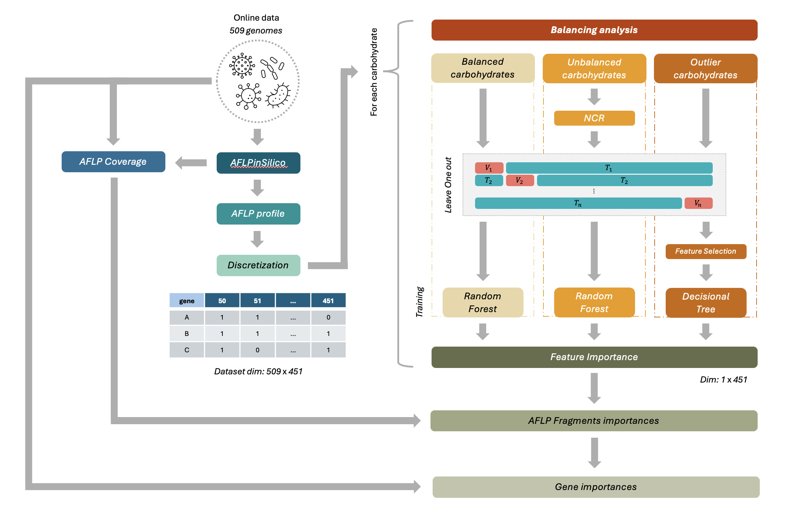
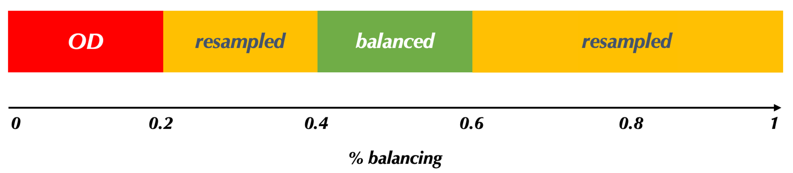
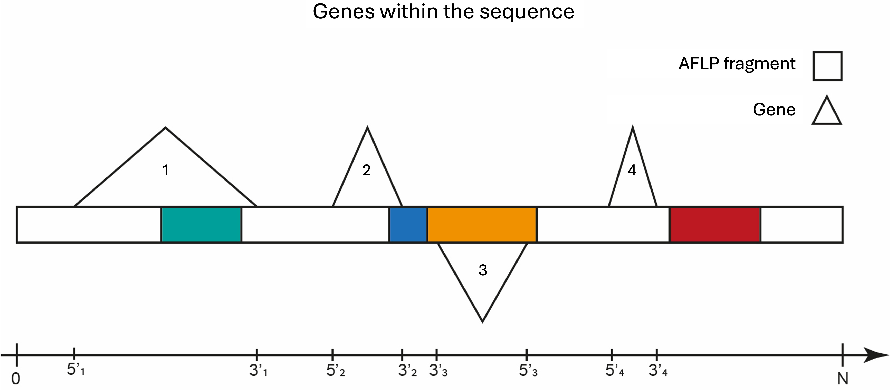

# Microbial Activity Prediction Pipeline

*Pipeline for microbial activity prediction from simulated AFLP profiles and API 50 CH data. It generates AFLP profiles in silico, discretizes features, trains ML models, computes feature importances, and maps these values onto fragments and genes for pangenomic analysis.*


<h2>Table of Contents</h2>

- [Requirements](#requirements)
- [Usage](#usage)
- [Description](#descrizione-breve)
  - [Data Splitting Rules](#rules)
  - [Gene importance and pangenome analysis](#geni)
- [Publication](#pub)
- [References](#ref)


<h2 id="requirements">Requirements</h2>

To create and use a virtual environment to isolate project dependencies, run:

```bash
python -m venv ml_aflp50
source ml_aflp50/bin/activate
pip install -r requirements.txt
```


<h2 id="usage">Usage</h2>

1. **Dataset download**: Execute the notebook `Code/BacDive.ipynb` to download the BacDive dataset and generate the required data files in the `Data/` directory.

2. **Main pipeline**: Execute the notebook `AFLP_API50.ipynb` to run the complete machine learning pipeline.

3. **PanDelos pipeline**: Execute the notebook `Pandelos_Analysis.ipynb` to compute the pangenome analysis.


<h2 id="descrizione-breve">Description</h2>
This project implements a complete workflow for using AFLP profiles (simulated via software) as biomarkers. The process goes from profile generation to feature discretization, training of machine learning models, extraction of feature importances, and genomic mapping of these values to identify candidate genes for further analysis with functional methods (e.g., enrichment). 
 
<p align="center" style="padding-top: 30px;">
    
</p>


<h3 id="rules">Data Splitting Rules</h3>

For each output variable $o$ (e.g., the response to a single carbohydrate), we compute the positivity rate $\rho$ as:

$$
\rho = \frac{\text{number\_of\_positive\_samples}}{\text{total\_number\_of\_samples}}
$$

<p align="center">
    
</p>

Based on the value of $\rho$, each dataset associated with variable $o$ is assigned to one of the following three categories. For each category, the corresponding pipeline actions are specified.

| Category | Condition on `ρ` | Actions |
| -: | :-: | :- |
| **Balanced** | `ρ ∈ (0.4, 0.6)` | Standard training procedure using random forest. |
| **Semi-balanced** | `ρ ∈ [0.2, 0.4] ∪ [0.6, 0.8]` | Apply undersampling techniques. Standard training procedure using random forest. |
| **Unbalanced** | `ρ ≤ 0.2 ∨ ρ ≥ 0.8` | Specific pipelines for imbalance: LOO approaches with frequency-based feature selection and decision tree training. |


<h3 id="geni">Gene importance and pangenome analysis</h3>
Feature importance is computed using two complementary approaches: Random Forest — where importances are taken directly from the trained model — and (ii) a frequency-based selection inside Leave-One-Out (LOO) cycles for highly imbalanced phenotypes (each LOO iteration produces a binary vector of selected features; final feature scores are the column-wise average across all cycles).

<br>

Feature importances are then mapped to in-silico AFLP fragments: each fragment (50–500 bp) inherits the importance of the corresponding feature length and that value is distributed across its nucleotide interval; overlapping fragments share the maximum importance in the overlap. Gene importance is obtained by averaging the nucleotide importances across the gene coordinates (coordinates are swapped when the gene lies on the complementary strand).

<p align="center">
    
</p>

Pangenomic analyses are performed with PanDelos[1]: we extract gene families from all genomes and compute each family’s **diffusivity** (the number of distinct genomes containing at least one member of the family). A dedicated notebook in the repository takes the PanDelos output as input and performs the family-level aggregation and downstream analyses.


<h2 id="pub">Publication</h2>

If you use this project, please cite our paper:

```bibtex
@article{
    ...
}
```


<h2 id="ref">References</h2>

[1] PanDelos-Plus: https://doi.org/10.7490/f1000research.1120001.1